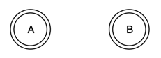

# Graphs &mdash; Introduction


###### Overview

Graphs are interesting data structures.  They more closely model real-world problems than the others.  We can use
 graphs to enable all the computers on the Internet to connect to each other.  Every reachable computer can be stored
 as a vertex in a graph on a device called a router.  Routers find the connections between computers and enable them
 to communicate.  The mechanism that enables this is called a Minimum Spanning Tree -- a type of graph.

Amazon is able to deliver most goods to people within days for very reasonable prices.  They do this by placing 
 distribution centers in all parts of the world.  They use graphs to figure out how to efficiently get a product
 shipped to you quickly, and to figure out how to keep the right inventory replenished to maintain the customer
 satisfaction that our impatience demands.  We like things NOW!


##### Terminology

 **Graph**: A collection of nodes that has zero or more connections between them
 
 **Vertex**: A vertex is a node.  It has the data and links the connections between other vertices
 
 **Edge**: A connection between two vertices
 
 **Directed**: A connection that goes in one direction from a vertex to the another
 
 **Undirected**: A connection that runs both ways between vertices

 

 
 **Path**: A route between a vertex and edges to another vertex

 
 
 
 **Cyclic/Cycle**: A path that starts and ends at the same vertex
 
 
 
 
 **Cyclic**: A graph that contains at least one circuit
 
 **Acyclic**: A graph that provides only one way to connect two vertices
 
 **Disjoint**: Two subgraphs are edge or vertex disjoint if they share no edges or vertices
 
 **Order**: The number of vertices in a graph, called `n`
 
 **Size**: The number of connections in a graph, called `m`
 
 **Root**: A designated vertex
 
 
<br />
Linked Lists and Trees are a type of graph.  We draw them with connections between one node and the other.  They
 are very predictable, though.  Graphs can have connections from anywhere to anywhere and this makes it more challenging
 to work with them.  Before jumping into creating a graph, lets take some time to understand their inner workings.
 
 
##### Edge Lists

Using what is called an Adjacency List, we can represent the following graph as a list of edges in the following
 way:
 


```
graph {
  Nodes: [A, B, C, D]
  Edges: [ [A,B], [A,D], [B, A], [D, A], [D, B], [B, C], [C, D] ]
}
```


###### Exercises


##### Exercise 1

Draw this graph on a whiteboard (or paper).  Make a directed or undirected connection between the vertices.  Then
 write the internal graph representation for it.
 
 


#### Exercise 2

Draw this graph on a whiteboard (or paper).  Make a directed or undirected connection between the vertices.  Then
 write the internal graph representation for it.
 
 


#### Exercise 3

Draw this graph on a whiteboard (or paper).  Make a directed or undirected connection between the vertices.  Then
 write the internal graph representation for it.
 
  


#### Exercise 4

Draw this graph on a whiteboard (or paper).  Make a directed or undirected connection between the vertices.  Then
 write the internal graph representation for it.
 
 


#### Exercise 5

Write down the internal representation of the following graph.
 
 


#### Exercise 6

Continuing from Exercise 5, answer the following questions below:
 
 
 
 
 1. What nodes are can be accessed from A.
 2. Is there a cycle?  What is the cycle path?
 3. Can I access A?  Why or why not?
 

###### Edge Cases

 * What to do when the graph is empty
 * What to do when there are only 1 or two edges
 * What to do when the graph is disjoint
 * What to do when the graph has cycles
 

###### NOTES

    

###### This Exercise


Open [graphs-L0.js](ES6/src/graphs-L0.js) and follow the prompts below to complete the exercise.  Use 
 the [testRunner0.html](ES6/testRunner0.html) file to run the tests and view your progress.


###### Objective


###### Critical Whiteboard Skills

  TBD