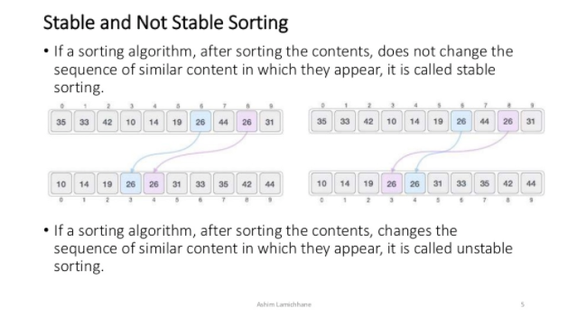
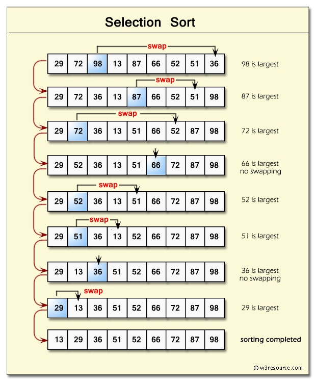
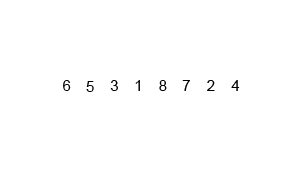
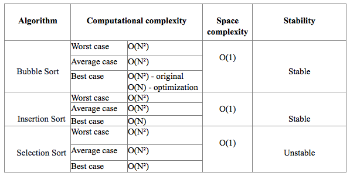

# Sorting &mdash; Part I

###### Overview

We will discuss:
 
 1. Bubble Sort
 2. Insertion Sort
 3. Selection Sort
 4. Merge Sort
 5. Quick Sort

 

 * **In-place** means can be sorted with only constant memory (Bubble, Selection, Insertion)
 * **Recursion** is rarely in-place, and uses extra memory
 * An **unstable** sort means that multiple values can be sorted in any relative order (Selection)
 * **Stable** sort means that the relative order of values is preserved when sorting.  More
   useful in cases with multiple sort keys { first name, last name }.  Maybe its
   already sorted by last name, now we sort by first.  The order of last name
   should be preserved (Bubble, Insertion, Merge)
 * **Adaptive** sorting gives better performance if the set is partially sorted already (Bubble, Insertion)
 * **Serial/Parallel** sorting: Parallel allows the sorting to be divided among
   multiple CPUs to gain efficiencies thereby
 * **External** Sorting algorithms allow us to sort large data sets with very
   limited memory.
 * **Comparison** algorithms arrange two elements in ascending order when the smaller element is placed before the larger one
 

###### Edge Cases

 * Runtime when sorted already
 * Runtime when partially sorted
 * Runtime when sorted in reverse order
 * Runtime when totally unsorted
 * Is Stable?
 

###### NOTES

###### Stable vs Unstable Sorts

###### BubbleSort

 

###### Selection Sort

 

###### Insertion Sort

 

###### Merge Sort

  

###### Sort Comparisons

###### This Exercise

Open [sorting-L1.js](ES6/src/sorting-L1.js) and follow the prompts below to complete the exercise.  Use 
 the [testRunner1.html](ES6/testRunner1.html) file to run the tests and view your progress.

###### Objective

 * Optimize the bubbleSort so it returns once it detects the array is already sorted
 