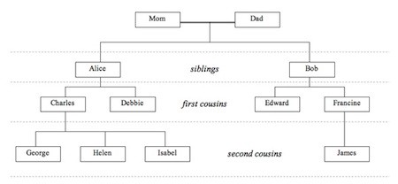

# Trees &mdash; Introduction

###### Overview

Until now, we've focused on sequential and associative structures.  Not all data is modeled sequentially.  Trees
 provide a way to organize data via hierarchy with parent-child relationships.  Data like our family tree, organization
 charts, or even the file system on your computer are excellent examples of hierarchical data structures.

##### Family Tree Example

###### Edge Cases

 

###### NOTES

    

###### This Exercise

Open [trees-L0.js](ES6/src/trees-L0.js) and follow the prompts below to complete the exercise.  Use 
 the [testRunner0.html](ES6/testRunner0.html) file to run the tests and view your progress.

###### Objective

###### BONUS:

###### Critical Whiteboard Skills

 